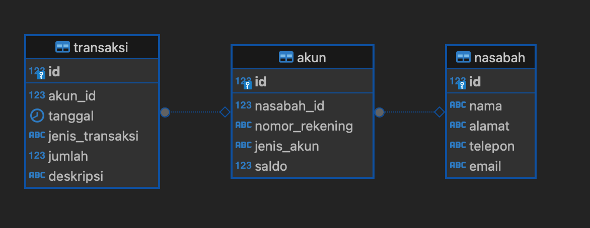
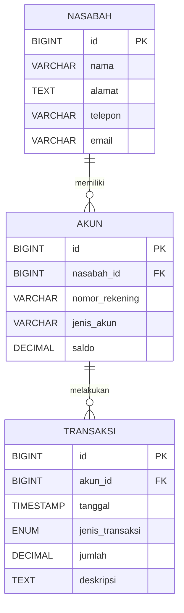

# Entity-Relationship Diagram (ERD)

```mermaid
erDiagram
    NASABAH {
        BIGINT id PK
        VARCHAR nama
        TEXT alamat
        VARCHAR telepon
        VARCHAR email
    }
    AKUN {
        BIGINT id PK
        BIGINT nasabah_id FK
        VARCHAR nomor_rekening
        VARCHAR jenis_akun
        DECIMAL saldo
    }
    TRANSAKSI {
        BIGINT id PK
        BIGINT akun_id FK
        TIMESTAMP tanggal
        ENUM jenis_transaksi
        DECIMAL jumlah
        TEXT deskripsi
    }

    NASABAH ||--o{ AKUN : memiliki
    AKUN ||--o{ TRANSAKSI : melakukan
```
